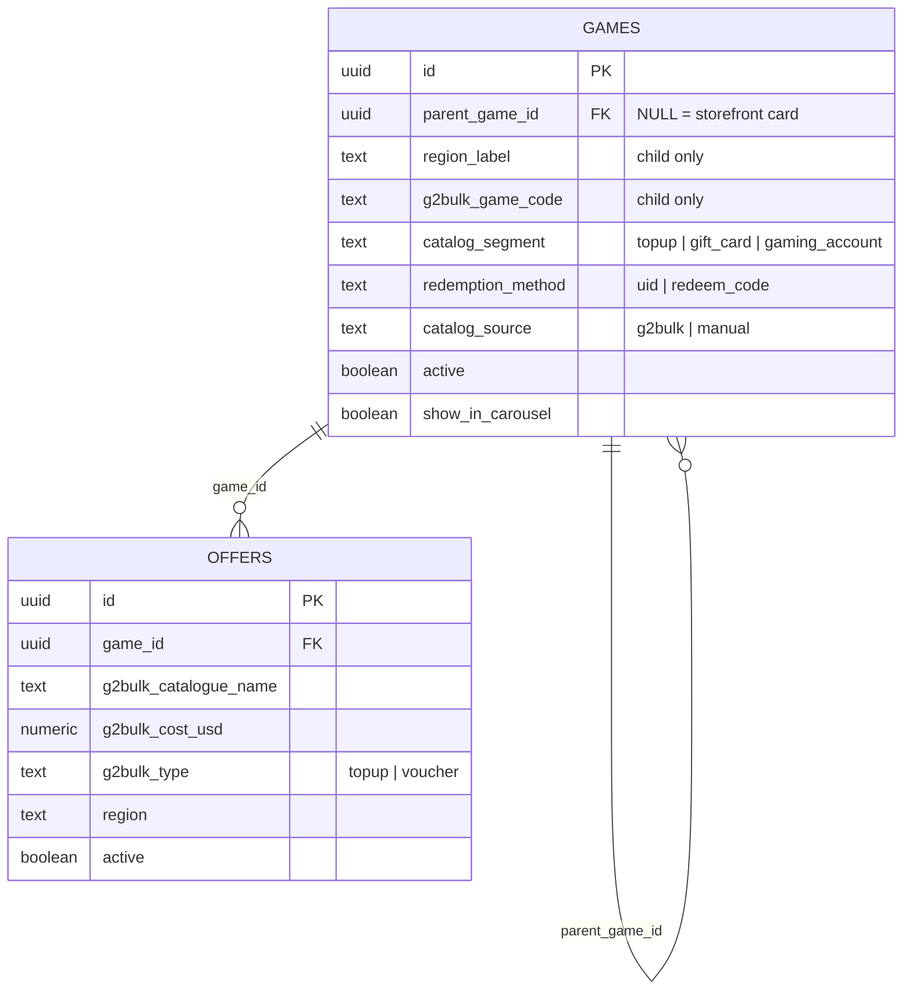
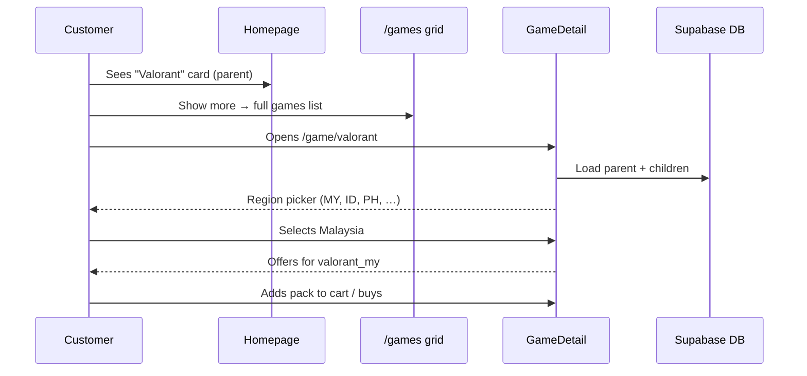
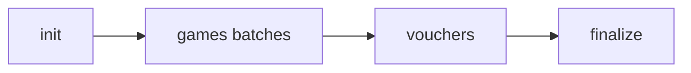
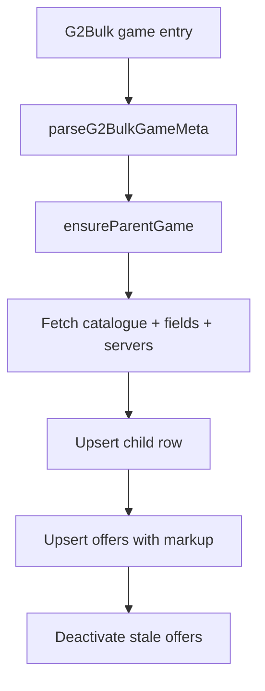
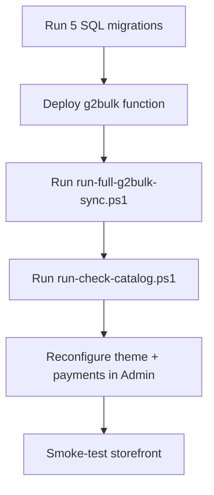

# EchoCore Store — Full Catalog & Operations Guide

> **Last verified:** 2026-07-12  
> **Supabase project:** `uaiirtgzqtnrvcrlxstg`  
> **Status:** G2Bulk sync live · Charm pricing (tiered) · Admin supplier-cost badges · Game currency labels

This document is the single reference for how the EchoCore storefront catalog is structured, how G2Bulk sync/check works, what was changed in the UI, and how to operate or recover the store.

---

## Table of contents

1. [Executive summary](#1-executive-summary)
2. [Live database snapshot](#2-live-database-snapshot)
3. [Architecture overview](#3-architecture-overview)
4. [Catalog model](#4-catalog-model)
5. [Region parsing](#5-region-parsing)
6. [Storefront UI](#6-storefront-ui)
7. [Routes & navigation](#7-routes--navigation)
8. [Homepage layout](#8-homepage-layout)
9. [G2Bulk edge functions](#9-g2bulk-edge-functions)
10. [Sync pipeline](#10-sync-pipeline)
11. [Check-for-updates pipeline](#11-check-for-updates-pipeline)
12. [Admin panel (G2Bulk)](#12-admin-panel-g2bulk)
13. [SQL migrations](#13-sql-migrations)
14. [PowerShell scripts](#14-powershell-scripts)
15. [Fresh start procedure](#15-fresh-start-procedure)
16. [Post-fresh-start checklist](#16-post-fresh-start-checklist)
17. [Key source files](#17-key-source-files)
18. [Troubleshooting](#18-troubleshooting)
19. [Verification queries](#19-verification-queries)

---

## 1. Executive summary

### What was built

| Goal | Implementation |
|------|----------------|
| One card per game title (Valorant, PUBG, …) | Parent `games` rows (`parent_game_id IS NULL`) |
| Regions inside game detail | Child rows per G2Bulk code (`parent_game_id` + `region_label`) |
| Gift cards ≠ games | `catalog_segment = gift_card`, route `/gift-cards` |
| Platform accounts ≠ games | `catalog_segment = gaming_account`, route `/accounts` |
| Cleaner nav | **Categories** hover menu replaces top category bar + scattered header links |
| Homepage games teaser | 9 cards shown; last 3 dimmed; **Show more** overlay links to `/games` |
| Admin “Check for updates” | `checkCatalog` action in `g2bulk` edge function |
| Faster sync/check | Batch size **32** (sync, check, cron, CLI) |
| Fresh start | Wipe catalog/orders; reset theme & payments; keep API key; full re-sync |
| Storefront pricing | Markup % + optional charm tiers (`.49` / `.89` / `.99`) on `offer.price` |
| Admin supplier cost | `g2bulk_cost_usd` badge on game/offer UI (admins only) |
| Pack labels | Game currency suffix (e.g. `60 UC`, `Riftcrystal`) via `gameCurrency.js` |
| Marketing copy | Per-game descriptions in `gameDescriptions.js` on hero/carousel |

### Critical bug fixed (2026-07-09)

Early sync runs reported success but **~145 games had zero offers** because child row inserts failed on **slug collisions** (child slug equaled parent slug, e.g. `azur-lane`).

**Fix:** `childGameSlug()` in `supabase/functions/g2bulk/index.ts` appends `--{code}` when parent and code slugs collide.

After fix + re-sync: **208 region children**, **5,732 offers**, **0 parents without children**.

---

## 2. Live database snapshot

Verified against linked Supabase on **2026-07-09**:

### Store settings

| Setting | Value |
|---------|-------|
| `g2bulk_enabled` | `true` |
| `g2bulk_catalog_mode` | `sync` |
| `g2bulk_catalog_only` | `true` |
| `g2bulk_last_sync_at` | `2026-07-09 12:38:08 UTC` |
| `g2bulk_last_check_at` | `2026-07-09 12:39:31 UTC` |
| `theme` | `{}` (reset) |
| `shamcash_enabled` | `false` |
| `binance_enabled` | `false` |
| `mastercard_enabled` | `false` |
| `home_layout` sections | 7 |

### Catalog counts

| Metric | Count |
|--------|-------|
| Total games | **531** |
| Total offers | **5,732** |
| Top-up parents | **161** |
| Region children | **208** |
| Voucher games | **162** |
| Gift card segment | **33** |
| Gaming account segment | **129** |
| Parents missing children | **0** |

### Valorant regions (example)

| Child name | Region | G2Bulk code | Active offers |
|------------|--------|-------------|---------------|
| Valorant (Malaysia) | Malaysia | `valorant_my` | 6 |
| Valorant (Indonesia) | Indonesia | `valorant_id` | 6 |
| Valorant (Philippines) | Philippines | `valorant_ph` | 6 |
| Valorant (Singapore) | Singapore | `valorant_sg` | 6 |
| Valorant (Thailand) | Thailand | `valorant_th` | 6 |
| Valorant (Vietnam) | Vietnam | `valorant_vn` | 6 |
| Valorant (Cambodia) | Cambodia | `valorant_kh` | 6 |
| Valorant | Global | `valorant` | 0 |

> **Note:** Global `valorant` child exists but has no live catalogue packs; regional variants hold the purchasable offers.

### Last catalog check result

| Metric | Value |
|--------|-------|
| New games | 0 |
| Removed games | 0 |
| New offers | 141 |
| Price changes | 2 |
| Removed offers | 0 |
| Stock changes | 0 |

---

## 3. Architecture overview

### High-level system diagram

```mermaid
flowchart TB
  subgraph Client["React storefront (Vite)"]
    Home[HomeView]
    Games[/games]
    Gift[/gift-cards]
    Acct[/accounts]
    Detail[GameDetail]
    Admin[Admin G2Bulk]
  end

  subgraph Supabase["Supabase (uaiirtgzqtnrvcrlxstg)"]
    DB[(PostgreSQL)]
    FnG2[g2bulk edge function]
    FnCron[g2bulk-sync-cron]
  end

  subgraph External["G2Bulk API"]
    API[games + vouchers catalogue]
  end

  Home --> Games
  Home --> Gift
  Home --> Acct
  Games --> Detail
  Gift --> Detail
  Acct --> Detail

  Client --> DB
  Admin --> FnG2
  FnG2 --> DB
  FnG2 --> API
  FnCron --> FnG2
```

### Catalog data model



### User journey — regional top-up game



---

## 4. Catalog model

### Three storefront segments

| Segment | `catalog_segment` | `redemption_method` | Where shown | Examples |
|---------|-------------------|---------------------|-------------|----------|
| **Games (top-ups)** | `topup` | `uid` | `/games`, homepage games section | Valorant, PUBG Mobile, MLBB |
| **Gift cards** | `gift_card` | `redeem_code` | `/gift-cards` | In-game voucher codes |
| **Gaming accounts** | `gaming_account` | `redeem_code` | `/accounts` | Xbox, PlayStation, iTunes, Razer Gold, Steam wallet |

Classification logic lives in:

- `src/lib/catalogSegments.js` (frontend)
- `supabase_echocore_full.sql` §15 (catalog_segment backfill)

**Rule of thumb:** Platform/subscription brands → `gaming_account`. In-game currency/voucher titles → `gift_card`. UID top-ups → `topup`.

### Parent vs child rows

| Row type | `parent_game_id` | `g2bulk_game_code` | Visible on grids | Holds offers |
|----------|------------------|--------------------|------------------|--------------|
| **Parent** | `NULL` | `NULL` | Yes (one card per title) | No |
| **Child** | → parent UUID | G2Bulk code | No (detail page only) | Yes |

**Storefront filtering** (`src/lib/gameRegions.js`):

- `getStorefrontGames()` — deduped parent cards for top-ups only
- `getStorefrontVoucherGames()` — parent voucher products
- `getRegionVariants()` — children for region picker on detail page

### Carousel

Only **parent** UID games (`parent_game_id IS NULL`, `redemption_method = uid`, active, with image) are eligible for the homepage carousel. Set during sync `finalize` phase (max 12).

---

## 5. Region parsing

Region metadata is shared between frontend and edge function:

| File | Used by |
|------|---------|
| `src/lib/regionMeta.js` | React app |
| `supabase/functions/g2bulk/regionMeta.ts` | G2Bulk sync |

### `parseG2BulkGameMeta(code, name)` extracts

- `baseKey` — grouping key (e.g. `valorant`)
- `baseName` — display title (e.g. `Valorant`)
- `regionLabel` — human region (e.g. `Malaysia`)

### Detection sources (in order)

1. **Code suffix** — `valorant_my` → Malaysia  
2. **Parentheses in name** — `PUBG Mobile (Turkey)`  
3. **Dash segments** — `Game Name - SEA`  
4. **Trailing words** — `Valorant Malaysia`, `PUBG Mobile Turkey`  
5. **Token map** — 80+ country/region tokens (`my` → Malaysia, `tr` → Turkey, …)

### Child slug generation

```text
childGameSlug(baseKey, code):
  parentSlug = slugify(baseKey)    → "valorant"
  codeSlug   = slugify(code)       → "valorant-my" or "azur-lane"
  if codeSlug === parentSlug:
    return "{parentSlug}--{codeSlug}"   → avoids UNIQUE slug collision
  else:
    return codeSlug
```

---

## 6. Storefront UI

### Navigation (`src/components/layout/SiteNav.jsx`)

**Before:** Top category bar + separate header links for games / gift cards / accounts.

**After:**

```text
Categories ▾  ·  Offers  ·  More ▾
```

**Categories hover menu** (`src/lib/catalogNav.js`):

| Item | Path | Description key |
|------|------|-----------------|
| Games | `/games` | `categoryGamesDesc` |
| Gift cards | `/gift-cards` | `categoryGiftCardsDesc` |
| Accounts | `/accounts` | `categoryAccountsDesc` |

`CategoryBar.jsx` was removed from all views.

### Homepage games section (`src/views/home/HomeView.jsx`)

| Constant | Value | Behavior |
|----------|-------|----------|
| `HOME_GAMES_PREVIEW` | 9 | Total cards rendered |
| `HOME_GAMES_CLICKABLE` | 6 | First 6 are clickable |
| Cards 7–9 | teaser | Dimmed, `pointer-events-none`, `aria-hidden` |
| Overlay | — | **Show more games (N)** button → `/games` |

CSS classes: `home-games-card-slot--teaser`, `home-games-preview-overlay` in `src/index.css`.

### Game detail (`src/views/GameDetail.jsx`)

- Resolves storefront parent via `resolveStorefrontGame()`
- Loads region variants via `getRegionVariants()`
- URL param `?region=malaysia` for deep-linking
- Shows region picker when `regionVariants.length > 1`
- Offers filtered to active variant's `game_id`

---

## 7. Routes & navigation

| Path | View | Catalog filter |
|------|------|----------------|
| `/` | HomeView | Mixed sections |
| `/games` | AllGamesView | Top-up parents only |
| `/gift-cards` | GiftCardsView | `gift_card` vouchers |
| `/accounts` | GamingAccountsView | `gaming_account` vouchers |
| `/search` | SearchView | All storefront products |
| `/sale` | SaleOffersView | Sale offers |
| `/game/:slug` | GameDetail | Parent + regions |
| Admin | AdminView → G2Bulk tab | Sync / check settings |

---

## 8. Homepage layout

Configured in `store_settings.home_layout` (JSON array). Default after fresh start:

| # | Section type | Enabled | Notes |
|---|--------------|---------|-------|
| 1 | `carousel` | yes | Hero carousel (parent games) |
| 2 | `sale_offers` | yes | limit 8 |
| 3 | `suggested_offers` | yes | limit 8, random per visit |
| 4 | `games` | yes | 9-card teaser grid |
| 5 | `gift_cards` | yes | limit 6 |
| 6 | `gaming_accounts` | yes | limit 6 |
| 7 | `customer_reviews` | yes | limit 8 |

Editable in Admin → Home layout. Types defined in `src/lib/homeLayout.js`.

---

## 9. G2Bulk edge functions

### `g2bulk` (`supabase/functions/g2bulk/index.ts`)

| Action | Auth | Purpose |
|--------|------|---------|
| `getMe` | Admin JWT | Test API key, read wallet balance |
| `getSettings` | Admin JWT | Read G2Bulk settings (key masked) |
| `checkPlayer` | Admin JWT | Validate player ID for a game |
| `fulfillOrder` | Service | Place G2Bulk order after payment |
| `syncCatalog` | Admin / service role / cron | Import games + vouchers to DB |
| `checkCatalog` | Admin / service role / cron | Diff live API vs DB |
| `browseCatalog` | Admin JWT | Live preview without writing |
| `ensureCatalogItems` | Admin JWT | Import selected live items |

**Auth modes:**

| Mode | Headers | Allowed actions |
|------|---------|-----------------|
| Admin session | `Authorization: Bearer {user_jwt}` | All admin actions |
| Service role | `Authorization: Bearer {service_role}` + `apikey: {anon}` | `syncCatalog`, `checkCatalog` |
| Cron secret | `x-g2bulk-cron-secret: {secret}` | `syncCatalog`, `checkCatalog` |

**Batch limit:** `CATALOG_BATCH_MAX = 32`

### `g2bulk-sync-cron` (`supabase/functions/g2bulk-sync-cron/index.ts`)

- Scheduled auto-sync via Supabase cron
- `GAMES_BATCH_SIZE = 32` (aligned with main function)
- Resumes from `store_settings.g2bulk_sync_state`
- Skips if already synced today (timezone-aware)

---

## 10. Sync pipeline

### Phases



| Phase | What happens |
|-------|--------------|
| **init** | Optionally hide manual catalog; fetch 208 G2Bulk games; cache list in `g2bulk_sync_state` |
| **games** | For each batch (32): `syncTopupGame()` per code |
| **vouchers** | Sync gift card / account categories from G2Bulk |
| **finalize** | Set carousel parents; write `g2bulk_last_sync_at`; clear sync state |

### Per-game sync (`syncTopupGame`)



**Data written per child:**

- `description_en/ar` from G2Bulk field notes
- `servers` JSONB from `games/servers` endpoint
- `region_label` from region parser
- Offers: `g2bulk_cost_usd` (supplier), `price` (customer), markup from `g2bulk_markup_percent` (default 15%)

### Pricing model (two money flows)

| Field / step | Who sees it | What it is |
|--------------|-------------|------------|
| `offers.g2bulk_cost_usd` | Admin only (badge) | G2Bulk wholesale — debited from **your G2Bulk wallet** on fulfill |
| Markup + charm | Stored in `offers.price` | What the **customer pays** (balance, checkout, invoices) |
| `create_order_atomic` | Server | Re-reads `offers.price` — client cannot underpay |

**Charm pricing** (optional, `g2bulk_charm_pricing_enabled`): after markup, round up within each dollar:

| Marked price (cents) | Rounds to |
|----------------------|-----------|
| Under $0.50 (e.g. `0.43`) | `.49` |
| $0.50–$0.84 (e.g. `1.68`) | `.89` |
| $0.85+ (e.g. `0.85`, `0.94`) | `.99` |

Example: cost → markup `1.23` → charm **`1.49`** on storefront; G2Bulk still charges ~wholesale on fulfill.

**Code:** `src/lib/charmPricing.js` · `supabase/functions/g2bulk/charmPricing.ts`

---

## 11. Check-for-updates pipeline

### Phases (mirrors sync)

| Phase | What happens |
|-------|--------------|
| **init** | Compare live game codes vs DB children; count new/removed games |
| **games** | Per code: diff catalogue names, prices, availability |
| **vouchers** | Diff voucher products |
| **finalize** | Merge totals; save `g2bulk_check_summary`; set `g2bulk_last_check_at` |

### Diff metrics

| Metric | Meaning |
|--------|---------|
| `newGames` | Live codes not in DB |
| `removedGames` | DB codes no longer in live API |
| `newOffers` | Catalogue entries in API but not DB |
| `priceChanges` | Cost differs by > $0.001 |
| `removedOffers` | Active DB offer missing from API |
| `stockChanges` | Voucher stock changed |
| `unchangedOffers` | Exact match |

---

## 12. Admin panel (G2Bulk)

**Location:** Admin → Settings → G2Bulk (`src/components/admin/AdminG2BulkSettings.jsx`)

### Available actions

| Button | Backend | Notes |
|--------|---------|-------|
| Test connection | `getMe` | Shows wallet balance |
| Sync catalog | `syncCatalog` | Batched; shows progress bar |
| Check for updates | `checkCatalog` | Non-destructive diff |
| Save settings | RPC `save_g2bulk_settings` | Markup, charm toggle, mode, auto-sync hour |
| Apply charm prices | `applyCharmPricing` action | Re-price synced offers from `g2bulk_cost_usd` |

### Catalog status indicators

| Status | Condition |
|--------|-----------|
| `never` | `g2bulk_last_sync_at` is null |
| `current` | Check summary `upToDate = true` |
| `updates` | `totalChanges > 0` |
| `stale` | Checked before but summary not up to date |
| `checking` | Check in progress |

### Settings of note

| Setting | Recommended | Description |
|---------|-------------|-------------|
| `g2bulk_catalog_mode` | `sync` | Write G2Bulk data to DB (vs live-only) |
| `g2bulk_catalog_only` | `true` | Hide manual catalog entries |
| `g2bulk_markup_percent` | 15 | % added to G2Bulk cost |
| `g2bulk_charm_pricing_enabled` | false | Tiered `.49` / `.89` / `.99` after markup |
| `g2bulk_auto_sync_enabled` | true | Daily cron sync |
| `g2bulk_auto_sync_hour` | 5 | Hour in `g2bulk_auto_sync_timezone` |

---

## 13. SQL migrations

### Database setup (single file)

| File | Purpose |
|------|---------|
| `supabase_echocore_full.sql` | **Primary setup** — schema, RLS, RPCs, G2Bulk, charm pricing toggle, notifications, ShamCash (~3,000 lines) |

Sections §01–§15 cover everything that was previously split across migrations. Optional §A/§B at the bottom (commented) wipe test data — dev/staging only.

### Incremental migrations (existing DBs only)

If the project predates a feature, run the matching file in SQL Editor **or** re-run the full file (idempotent):

| File | Adds |
|------|------|
| `supabase_charm_pricing_migration.sql` | `g2bulk_charm_pricing_enabled` + `save_g2bulk_settings` / `get_g2bulk_settings` |
| `supabase_moderation_v3_user_auth_migration.sql` | Admin user auth edge support |
| `supabase_admin_gift_migration.sql` | Admin gift orders |
| `supabase_game_player_uids_migration.sql` | Saved player UIDs on profile |
| `supabase_catalog_voucher_normalization_migration.sql` | Voucher catalog normalization |
| Other `supabase_*.sql` at repo root | See filename; all merged into full SQL when possible |

After SQL changes that touch edge behavior, redeploy: `supabase functions deploy g2bulk`

### Fresh start — what is wiped

- `games`, `offers`, `orders`, `order_items`, `transactions`
- `customer_reviews`, `notifications`, `contact_messages`
- All `profiles.balance` → 0

### Fresh start — what is preserved

- Database schema
- `g2bulk_api_key` in `store_settings`
- All application code

### Fresh start — what is reset

- `theme` → `{}`
- All payment methods disabled
- `home_layout` → default 7 sections
- `g2bulk_catalog_mode` → `sync`
- `g2bulk_last_sync_at` / `g2bulk_last_check_at` → null

---

## 14. PowerShell scripts

All scripts live in `scripts/`. Require Supabase CLI linked to project.

### `run-fresh-start.ps1` — full reset pipeline

```powershell
.\scripts\run-fresh-start.ps1
```

Runs all 5 migrations → deploys `g2bulk` → runs full sync.

### `run-full-g2bulk-sync.ps1` — catalog sync only

```powershell
.\scripts\run-full-g2bulk-sync.ps1
```

- Batch size: 32
- Auth: service role JWT + anon `apikey` header
- Optional: `$env:G2BULK_CRON_SECRET`
- Prints batch errors if any occur

### `run-check-catalog.ps1` — catalog check only

```powershell
.\scripts\run-check-catalog.ps1
```

Runs full `checkCatalog` pipeline; prints summary.

### SQL verification scripts

| Script | Purpose |
|--------|---------|
| `check-catalog-state.sql` | Settings + sync/check timestamps |
| `count-catalog.sql` | Game/offer/segment counts |
| `verify-catalog.sql` | Parent games + region children sample |
| `verify-valorant.sql` | Valorant/PUBG region rows |
| `debug-valorant.sql` | Valorant children with offer counts |

**Run any SQL file:**

```powershell
supabase db query --linked -f scripts/count-catalog.sql
```

### Deploy edge functions

```powershell
supabase functions deploy g2bulk --project-ref uaiirtgzqtnrvcrlxstg
supabase functions deploy g2bulk-sync-cron --project-ref uaiirtgzqtnrvcrlxstg
```

---

## 15. Fresh start procedure

### Automated (recommended)

```powershell
cd C:\Users\Administrator\Coding\echocore-store
.\scripts\run-fresh-start.ps1
```

### Manual steps



### Expected outcome after sync

| Check | Expected |
|-------|----------|
| `topup_parents` | ~161 |
| `region_children` | ~208 |
| `parents_no_children` | 0 |
| `total_offers` | ~5,700+ |
| `g2bulk_last_sync_at` | Recent timestamp |

---

## 16. Post-fresh-start checklist

These are **intentionally blank** after fresh start — configure manually:

- [ ] **Theme** — Admin → Theme (colors, logo, fonts)
- [ ] **ShamCash** — API token, account ID, QR image
- [ ] **Binance Pay** — Enable + credentials
- [ ] **Mastercard** — Enable if applicable
- [ ] **Customer reviews** — Re-seed or wait for new submissions
- [ ] **Carousel** — Verify 12 games look correct (auto-set on sync)
- [ ] **Markup %** — Confirm `g2bulk_markup_percent` (default 15%)
- [ ] **Charm pricing** — Enable if desired; run **Apply charm prices** once after enabling
- [ ] **G2Bulk edge** — `supabase functions deploy g2bulk` after pricing/catalog changes
- [ ] **Smoke test** — Buy flow for one top-up + one voucher; verify admin cost badge vs customer price

---

## 17. Key source files

### Catalog logic

| File | Role |
|------|------|
| `src/lib/gameRegions.js` | Storefront dedup, region variants, offer routing |
| `src/lib/regionMeta.js` | Region parsing (frontend) |
| `src/lib/catalogSegments.js` | gift_card vs gaming_account classification |
| `src/lib/catalogUtils.js` | `getTopupGames`, `getGiftCardGames`, etc. |
| `src/lib/catalogNav.js` | Categories menu data |
| `src/lib/charmPricing.js` | Markup + tiered charm endings (client preview) |
| `src/lib/offerCost.js` | Wholesale cost helpers (`g2bulk_cost_usd`) |
| `src/lib/gameCurrency.js` | Pack currency labels (UC, diamonds, Riftcrystal, …) |
| `src/lib/gameDescriptions.js` | Per-game marketing blurbs |
| `src/lib/offerDisplay.js` | Pack names, prices, order snapshots |

### UI

| File | Role |
|------|------|
| `src/components/layout/SiteNav.jsx` | Categories hover nav |
| `src/views/home/HomeView.jsx` | 9-card teaser + sections |
| `src/components/ui/HomeGameCard.jsx` | Teaser mode support |
| `src/views/GameDetail.jsx` | Region picker + offers |
| `src/views/GiftCardsView.jsx` | Gift card grid |
| `src/views/GamingAccountsView.jsx` | Accounts grid |
| `src/views/AllGamesView.jsx` | Full games grid |

### Backend

| File | Role |
|------|------|
| `supabase/functions/g2bulk/index.ts` | Sync, check, fulfill, browse |
| `supabase/functions/g2bulk/regionMeta.ts` | Region parsing (edge) |
| `supabase/functions/g2bulk-sync-cron/index.ts` | Scheduled sync |
| `src/lib/g2bulk.js` | Frontend sync/check orchestration |
| `src/components/admin/AdminG2BulkSettings.jsx` | Admin UI |
| `src/components/admin/AdminOfferCostBadge.jsx` | Admin-only supplier cost on offer cards |
| `supabase/functions/g2bulk/charmPricing.ts` | Charm pricing (sync, live, applyCharmPricing) |
| `supabase/functions/g2bulk/gameCurrency.ts` | Currency suffix at sync time |

### Styles

| File | Role |
|------|------|
| `src/index.css` | `.home-games-card-slot--teaser`, `.admin-offer-cost`, `.offer-pack-label` |

---

## 18. Troubleshooting

### Sync says done but games have no offers

**Symptom:** Parent cards visible; 0 offers; `parents_no_children > 0`.

**Cause:** Slug collision on child insert (fixed 2026-07-09).

**Fix:**

1. Deploy latest `g2bulk` function
2. Re-run `.\scripts\run-full-g2bulk-sync.ps1`
3. Verify `parents_no_children = 0`

### Admin “Check for updates” → Unknown action

**Cause:** Old edge function without `checkCatalog`.

**Fix:** `supabase functions deploy g2bulk --project-ref uaiirtgzqtnrvcrlxstg`

### Sync/check returns 401 from CLI

**Cause:** Missing service role auth.

**Fix:** Scripts auto-resolve keys via `supabase projects api-keys`. Ensure CLI is logged in and project is linked.

### Check shows many “new games” after sync

**Cause:** Comparing live codes against parent rows (parents have `g2bulk_game_code = NULL`).

**Expected:** Compare against **child** rows only. After correct sync: `newGames = 0`.

### Valorant Global shows 0 offers

**Expected behavior** if G2Bulk `valorant` catalogue is empty; regional codes hold packs.

### Voucher sync shows `games: 0 offers: 1141`

Voucher phase updates offers on existing voucher game rows; `gamesSynced` counts **new** game inserts only.

### Batch errors during sync

Re-run sync script — it prints errors per batch:

```text
Batch 0 errors: azur_lane: duplicate key value violates unique constraint "games_slug_key"
```

After slug fix, these should not recur.

---

## 19. Verification queries

### Quick health check (one query)

```sql
SELECT
  (SELECT count(*) FROM games) AS total_games,
  (SELECT count(*) FROM offers) AS total_offers,
  (SELECT count(*) FROM games WHERE parent_game_id IS NULL AND redemption_method = 'uid') AS topup_parents,
  (SELECT count(*) FROM games WHERE parent_game_id IS NOT NULL) AS region_children,
  (SELECT count(*) FROM games p WHERE p.parent_game_id IS NULL
    AND p.redemption_method = 'uid' AND NOT EXISTS (
      SELECT 1 FROM games c WHERE c.parent_game_id = p.id
    )) AS parents_no_children;
```

**Healthy values (2026-07-09):** 531 · 5732 · 161 · 208 · 0

### Settings check

```sql
SELECT
  g2bulk_enabled,
  g2bulk_catalog_mode,
  g2bulk_last_sync_at,
  g2bulk_last_check_at,
  theme = '{}'::jsonb AS theme_reset,
  shamcash_enabled,
  binance_enabled
FROM store_settings
WHERE id = 1;
```

### Region children for a game

```sql
SELECT c.name_en, c.region_label, c.g2bulk_game_code,
       count(o.id) FILTER (WHERE o.active) AS offers
FROM games p
JOIN games c ON c.parent_game_id = p.id
LEFT JOIN offers o ON o.game_id = c.id
WHERE p.slug = 'valorant'
GROUP BY c.name_en, c.region_label, c.g2bulk_game_code
ORDER BY c.region_label;
```

---

## Appendix A — Environment & toolchain

| Item | Value |
|------|-------|
| Project name | `echocore-store` |
| Framework | React 19 + Vite |
| Styling | Tailwind CSS 4 |
| Database | Supabase PostgreSQL |
| Edge runtime | Deno (Supabase Functions) |
| Project ref | `uaiirtgzqtnrvcrlxstg` |
| Dev server | `npm run dev` |
| Production build | `npm run build` |

## Appendix B — G2Bulk API endpoints used

| Endpoint | Used in |
|----------|---------|
| `GET /games` | List all top-up games |
| `GET /games/{code}/catalogue` | Offers for a game |
| `POST /games/fields` | Description notes |
| `GET /games/{code}/servers` | Server list |
| Voucher categories API | Gift cards + accounts |
| `POST /games/order` | Fulfillment |
| `POST /games/order/status` | Delivery polling |

---

*This guide reflects the codebase and live database as verified on 2026-07-09. Re-run the verification queries after any future sync or fresh start to update the numbers.*